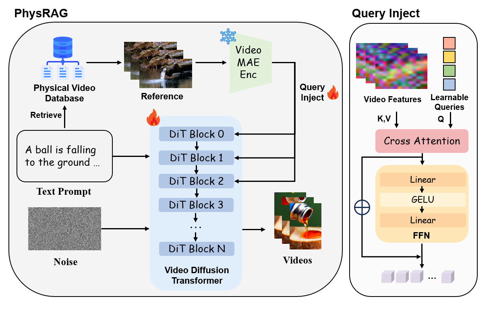
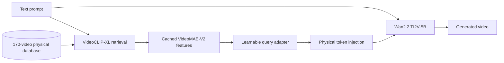
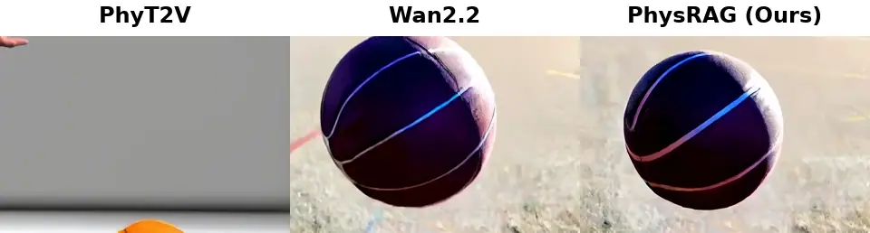
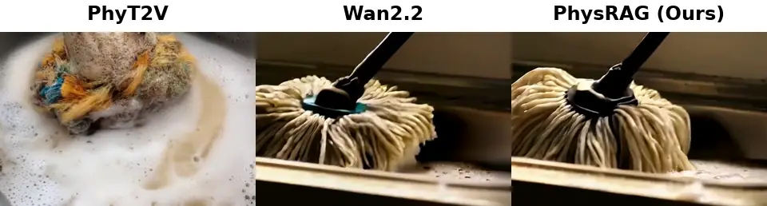
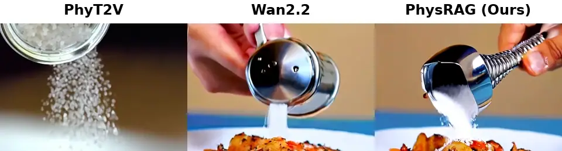
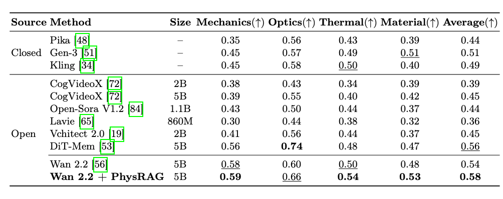

<div align="center">

# PhysRAG

### Enhancing Physics-Awareness in Video Generation via Retrieval-Augmented Generation

Kexu Cheng · Zicheng Liu · Mingju Gao · Chunhe Song · Hao Tang

[](https://github.com/spoil1024/PhysRAG)
[](https://huggingface.co/datasets/sediment1024/PhysRAG)
[](https://huggingface.co/Wan-AI/Wan2.2-TI2V-5B)
[](LICENSE)

**[Paper: coming soon] · [Project Page](https://github.com/spoil1024/PhysRAG) · [Dataset](https://huggingface.co/datasets/sediment1024/PhysRAG) · [Model: coming soon]**

</div>

<p align="center">
  
</p>
<p align="center">
  <b>PhysRAG retrieves real-world videos exhibiting related physical dynamics,
  distills their cached VideoMAE-V2 features with learnable queries, and injects
  the resulting priors into early video diffusion transformer blocks.</b>
</p>

PhysRAG equips a pretrained text-to-video diffusion transformer with physical
priors retrieved from real-world videos. Given a text prompt, VideoCLIP-XL
retrieves a physically relevant reference from a curated database. Offline
VideoMAE-V2 features are distilled through learnable query tokens and injected
into early Wan2.2 DiT blocks, guiding generation without changing the base
text-to-video interface.

## Highlights

- **Retrieval-augmented video generation:** retrieves physical evidence for each
  prompt instead of relying only on parametric knowledge.
- **Curated physical database:** 170 references covering 17 physical phenomena,
  selected from a 6,869-video training set.
- **Compact prior extraction:** 128 learnable queries attend to cached
  VideoMAE-V2 features as an information bottleneck.
- **Lightweight DiT integration:** physical tokens are injected at blocks
  `0, 1, 2` through gated residual fusion.
- **Reproducible release:** includes data curation, cache construction,
  DeepSpeed training, inference, and three evaluation wrappers.

## Method



The reference encoder is run offline. During training and inference, PhysRAG
loads cached reference features, applies cross-attention with learnable queries,
and injects the resulting tokens into the denoising transformer. See
[`wan/modules/physical_adapter.py`](wan/modules/physical_adapter.py) and
[`wan/modules/physical_injection.py`](wan/modules/physical_injection.py).

## Demo

The synchronized previews below show the first two seconds of each result in a
consistent left-to-right order: **PhyT2V | Wan2.2 | PhysRAG (Ours)**. All samples
use 49 frames at 704×480. The previews are compressed; the original MP4 package
is kept outside Git history for release separately.

<details open>
<summary><b>Elastic impact — basketball hitting the ground</b></summary>

> **Prompt:** A vibrant, elastic basketball is thrown forcefully towards the
> ground, capturing its dynamic interaction with the surface upon impact.

<p align="center">
  
</p>
</details>

<details open>
<summary><b>Liquid interaction — rinsing a dirty mop</b></summary>

> **Prompt:** A dirty mop is rinsed in a sink filled with soapy water, the dirt
> visibly washing away.

<p align="center">
  
</p>
</details>

<details open>
<summary><b>Granular material flow — pouring salt</b></summary>

> **Prompt:** Salt is poured from a shaker onto a plate of food, creating a
> visible layer of white granules.

<p align="center">
  
</p>
</details>

## Quantitative Results

On PhyGenBench, PhysRAG improves Wan2.2 across all four physical dimensions,
raising the average score from **0.54** to **0.58**. The largest improvements
are observed in Optics (**0.60** to **0.66**) and Material (**0.48** to
**0.53**).

<p align="center">
  
</p>
<p align="center">
  <sub>Quantitative comparison on PhyGenBench. Higher is better.</sub>
</p>

## Release Assets

| Component | Content | Location |
|---|---|---|
| Code | Training, RAG, inference, and evaluation | [GitHub](https://github.com/spoil1024/PhysRAG) |
| Dataset | 6,869 videos, prompts, metadata, and 27 tar shards | [Hugging Face](https://huggingface.co/datasets/sediment1024/PhysRAG) |
| RAG library | 170 references, cached features, and FAISS index | Included in the dataset repository |
| Model | PhysRAG checkpoint for Wan2.2 TI2V-5B | Coming soon |
| Base model | Wan2.2 TI2V-5B | [Wan-AI/Wan2.2-TI2V-5B](https://huggingface.co/Wan-AI/Wan2.2-TI2V-5B) |

The base Wan2.2, VideoMAE-V2, and VideoCLIP-XL checkpoints are not redistributed.

## Installation

The release is tested on Linux with Python 3.10, PyTorch 2.5.1, CUDA 12.4,
FlashAttention 2.8.3, and DeepSpeed 0.18.3.

```bash
git clone https://github.com/spoil1024/PhysRAG.git
cd PhysRAG

conda create -n physrag python=3.10 -y
conda activate physrag

pip install torch==2.5.1 torchvision==0.20.1 torchaudio==2.5.1 \
  --index-url https://download.pytorch.org/whl/cu124
pip install -r requirements.txt
pip install -r requirements_phyrag.txt
pip install flash-attn==2.8.3 --no-build-isolation
```

For other CUDA versions, install the corresponding PyTorch wheels. See
[`docs/INSTALL.md`](docs/INSTALL.md) and
[`docs/ENVIRONMENT.md`](docs/ENVIRONMENT.md).

## Download Assets

```bash
# Base model
huggingface-cli download Wan-AI/Wan2.2-TI2V-5B \
  --local-dir checkpoints/Wan2.2-TI2V-5B

# PhysRAG dataset and RAG package
huggingface-cli download sediment1024/PhysRAG \
  --repo-type dataset --local-dir data/PhysRAG

# Extract the 27 video shards and copy the RAG package
python tools/extract_dataset_shards.py \
  --dataset-dir data/PhysRAG \
  --output-dir data/physrag

# External retriever checkpoint
huggingface-cli download alibaba-pai/VideoCLIP-XL VideoCLIP-XL.bin \
  --local-dir checkpoints/VideoCLIP-XL
```

Place the released PhysRAG `merged_model.pt` under `checkpoints/PhysRAG/` once
the model repository is available.

## Inference

Generate one 49-frame, 704×480 video with top-1 RAG retrieval:

```bash
CUDA_VISIBLE_DEVICES=0 python finetune/infer_phygenbench_wan.py \
  --ckpt_dir checkpoints/Wan2.2-TI2V-5B \
  --physical_ckpt checkpoints/PhysRAG/merged_model.pt \
  --prompt "Molten metal is poured into a mold, flowing and cooling naturally." \
  --output_dir outputs/molten_metal \
  --size "704*480" \
  --frame_num 49 \
  --faiss_index_dir data/physrag/rag/faiss_index \
  --videoclip_xl_model_path checkpoints/VideoCLIP-XL/VideoCLIP-XL.bin \
  --rag_top_k 1
```

The generated video is written to `outputs/molten_metal/output.mp4`. For batch
PhyGenBench inference and manual reference overrides, see
[`docs/INFERENCE.md`](docs/INFERENCE.md).

The release path has been smoke-tested end to end on an NVIDIA H20 with top-1
retrieval, physical injection, one denoising step, and H.264 export at 49 frames
and 704×480 resolution.

## Training

Wan text embeddings and video latents are reproducible caches and are not
distributed. Build them before training:

The released 6,869-video dataset can be used to reproduce our training setup,
but it is not required by the method. PhysRAG can also be trained on a custom
video collection. Prepare two line-aligned files under `DATA_ROOT`: one text
prompt per line in `prompts_new.txt`, and the corresponding absolute or
`DATA_ROOT`-relative video path in `videos_new.txt`. Then point `DATA_ROOT` to
that directory and rebuild the Wan caches before training. Users may likewise
replace or extend the 170-video reference library and regenerate its
VideoMAE-V2 features and FAISS index for their own domains.

```bash
export CUDA_VISIBLE_DEVICES=0,1
export CKPT_DIR=$PWD/checkpoints/Wan2.2-TI2V-5B
export DATA_ROOT=$PWD/data/physrag
export CACHE_DIR=$DATA_ROOT/cache_wan_49f_480x704
export VIDEOCLIP_XL_MODEL_PATH=$PWD/checkpoints/VideoCLIP-XL/VideoCLIP-XL.bin

bash finetune/scripts/build_cache_wan_49f_704_2gpu.sh

export OUTPUT_DIR=$PWD/output/physrag_wan22_5b
bash finetune/scripts/train_physical_ti2v_5b_2gpu_49f.sh
```

The released configuration uses two GPUs, BF16, DeepSpeed ZeRO-3 with CPU
offload, gradient checkpointing, learning rate `1e-6`, 20 epochs, and checkpoint
saving every 400 optimizer steps. See [`docs/TRAINING.md`](docs/TRAINING.md).

## Evaluation

Wrappers are provided for:

- [PhyGenBench](evaluation/phygenbench/)
- [VideoPhy2](evaluation/videophy2/)
- [VBench](evaluation/vbench/)

Benchmark assets and evaluator checkpoints must be obtained from their original
repositories. See [`docs/EVALUATION.md`](docs/EVALUATION.md).

## Repository Structure

```text
PhysRAG/
├── finetune/                 # cache, training, and inference
├── wan/modules/              # physical adapter and DiT injection
├── PhysicalDB/               # VideoMAE and VideoCLIP-XL/FAISS utilities
├── tools/data_curation/      # WISA-80K filtering pipeline
├── evaluation/               # benchmark wrappers
├── docs/                     # detailed documentation
└── requirements*.txt
```

## License and Attribution

The PhysRAG code release is provided under Apache-2.0. Third-party code, models,
datasets, and benchmarks retain their original terms. In particular, the
VideoCLIP-XL assets are subject to their upstream license. See
[`SOURCE_LICENSE_INVENTORY.md`](SOURCE_LICENSE_INVENTORY.md) before reuse or
redistribution.

PhysRAG training videos are selected from
[`qihoo360/WISA-80K`](https://huggingface.co/datasets/qihoo360/WISA-80K).

## Acknowledgements

This project builds on [Wan2.2](https://github.com/Wan-Video/Wan2.2),
[VideoMAE-V2](https://github.com/OpenGVLab/VideoMAEv2),
[VideoCLIP-XL](https://huggingface.co/alibaba-pai/VideoCLIP-XL), and
[FAISS](https://github.com/facebookresearch/faiss). We thank the authors of
PhyGenBench, VideoPhy2, VBench, and WISA-80K for their public resources.

## Citation

```bibtex
@article{cheng2026physrag,
  title={PhysRAG: Enhancing Physics-Awareness in Video Generation via Retrieval-Augmented Generation},
  author={Cheng, Kexu and Liu, Zicheng and Gao, Mingju and Song, Chunhe and Tang, Hao},
  year={2026},
  note={Manuscript}
}
```

For details about the foundation model, refer to the official
[Wan2.2 repository](https://github.com/Wan-Video/Wan2.2).
